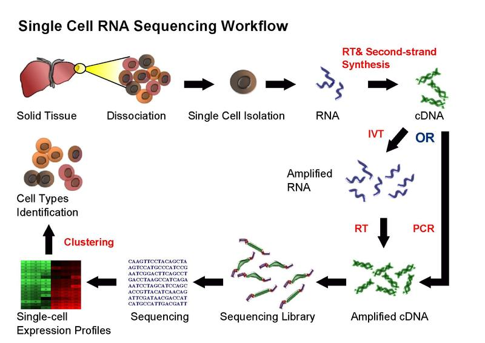

```{r setup, include=FALSE}
knitr::opts_chunk$set(echo = FALSE)
```

## The approach for today's workshop

We will focus more on:

- **understanding** the data than processing it.
- **processing** data than visualizing it.
- **visualizing** the data than analyzing it.

## Expectation management

This course designed for those who: 

- have basic knowledge of R
- want an overview of the area

This course will not necessarily make you self-reliant in complete analysis of your data. But will equip you to explore it more.

## What is single-cell RNA-Seq?

```{r, out.width = "700px"}

```

## Are there many kinds of scRNA-Seq methods?

Yes!

```{r, out.width = "700px"}
knitr::include_graphics("images/types.png")
```

## What's the final output after sequencing?

Base calls in BCL format.

Demo time!

## Now that I have the data what are the basic analyis step?

```{r, out.width = "340px"}
knitr::include_graphics("images/flowchart.png")
```

## What sequencing method will we cover today and what tools will we use?

10x genomics: Chromium 3' sequencing (version 2 chemistry)
(Cellranger and Seurat)

```{r, out.width = "650px"}

```

## Set up for cellranger demo

Login into the secure server
```
ssh parashar@aurora-ls2.lunarc.lu.se
```

An example dataset generated after sequencing on miSeq platform
```
/tmp/scrna_test/
```

Copy the data to your home folder
```
cd /tmp
cp -r scrna_test /home/parashar
cd /home/parashar/scrna_test
```

## Demo for running cellranger mkfastq
A note on Sample sheet
For miSeq
```
190121_M04223_0063_000000000-D5MWK/SampleSheet.csv
```
For cellranger
```
SampleSheet.csv
```

## Demo for running cellranger mkfastq
```
cat make_fastq.sh
```

## Demo for running cellranger mkfastq
```
#!/bin/sh
#SBATCH -A lsens2018-3-3
#SBATCH -p dell
#SBATCH -t 8:00:00
#SBATCH -J test_miseq
#SBATCH -o fastq_log.txt
#SBATCH --cpus-per-task=12
#SABTCH --mem=60G

module load GCCcore/6.3.0 bcl2fastq/2.19.1 cellranger/3.0.0

cellranger mkfastq --id=fastq \
                   --run=190121_M04223_0063_000000000-D5MWK \
                   --samplesheet=SampleSheet.csv \
                   --localcores=12 \
                   --localmem=60
```

## Demo for running cellranger mkfastq
```
sbatch make_fastq.sh
sinfo
```

After the job has finished i.e. you see nothing when you type `sinfo`, you should check out `fastq_log.txt` file.
The output (fastq files) is present in the following directory:
```
fastq/outs/fastq_path
```

Check out sample demultiplexing summary
```
fastq/outs/fastq_path/Reports/html/index.html
```

## Demo for running cellranger count
```
cat run_cr_count.sh
```

## Demo for running cellranger count
```
#!/bin/sh
#SBATCH -A lsens2018-3-3
#SBATCH -p dell
#SBATCH -t 8:00:00
#SBATCH -J test_miseq
#SBATCH -o count_log.txt
#SBATCH --cpus-per-task=12
#SABTCH --mem=60G
module load cellranger/3.0.0
CRREF=/projects/fs1/common/genome/lunarc/10Xindexes/cellranger/3.0/human/refdata-cellranger-GRCh38-3.0.0
cellranger count \
	--id=count_Sample1 \
	--fastqs=/home/parashar/scrna_test/fastq/outs/fastq_path \
	--sample=Sample1 \
	--transcriptome=$CRREF \
	--expect-cells=10000 \
	--localcores=12 \
	--localmem=60 \
	--chemistry=SC3Pv2
```

## Demo for running cellranger count
```
sbatch run_cr_count.sh
sinfo
```
Check out the log file when the job has finished.

This file: `count_Sample1/outs/web_summary.html` contains useful summary statistics.
Let's open this file and check it out

The files we need for further analysis are located in the following directory
```
ls count_Sample1/outs/filtered_feature_bc_matrix
```
```
barcodes.tsv.gz  features.tsv.gz  matrix.mtx.gz
```

## Install Seurat
install.packages("devtools")
require("devtools")
install.packages('Seurat')
library(Seurat)


